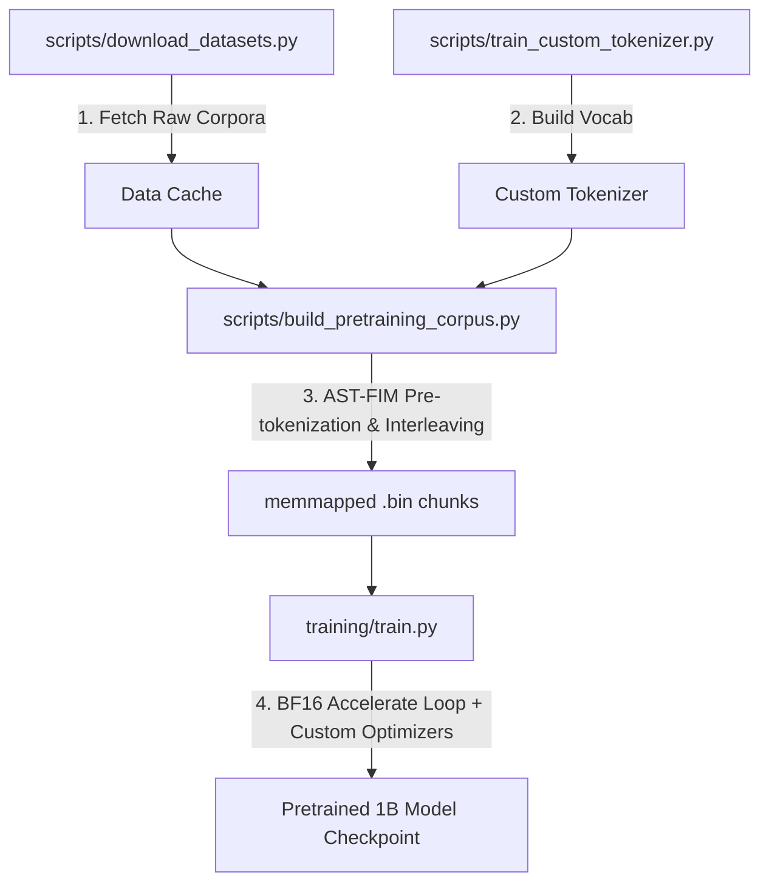

# 1B SLM: Production-Grade Pretraining Suite

A high-performance, production-grade pretraining suite for a **1.1 Billion Parameter Small Language Model (SLM)**. This repository contains the architecture, custom optimizers, dataset preparation pipeline, and training engines optimized for both pure `bfloat16` pretraining and legacy 4-bit block-scaled (NVFP4) training.

---

## 🏗️ Repository Architecture

```
.
├── training/                      # Main Pure BF16 Pretraining Package
│   ├── configs/                   # Model and Optimizer YAML Configurations
│   │   └── default.yaml
│   ├── layers/                    # Custom Transformer Sub-Layers
│   │   ├── attention.py           # Multi-Head Latent Attention (MLA)
│   │   ├── ffn.py                 # SwiGLU Feed-Forward Network
│   │   ├── norm.py                # Stable RMSNorm
│   │   ├── residual.py            # Softmax-routed Delta Residuals
│   │   └── rope.py                # Positional Embeddings & Cached RoPE
│   ├── models/                    # Composite Model Architecture
│   │   ├── embedding.py           # TST Embedding Layer
│   │   ├── mtp.py                 # Multi-Token Prediction (MTP) heads
│   │   └── transformer.py         # TransformerBlock and SLMModel
│   ├── optimizers/                # High-Performance Optimizer Suite
│   │   ├── kernels/               # Triton/Custom Kernels (RMSNorm, 4-bit SF-AdamW, SwiGLU)
│   │   ├── aurora.py              # Vanilla & Riemannian Aurora
│   │   ├── factory.py             # Shape-based Parameter Group Router
│   │   ├── hybrid.py              # Hybrid (Aurora 2D + 4-bit AdamW 1D)
│   │   ├── nf_aurora.py           # Schedule-Free NF-Aurora
│   │   ├── nf_aurora_hybrid.py    # Hybrid NF-Aurora + Triton 4-bit AdamW
│   │   ├── nf_normuon_hybrid.py   # Hybrid NF-NorMuon + Triton 4-bit AdamW
│   │   ├── polar.py               # Compiled Newton-Schulz Polar Factors
│   │   └── sf_normuon.py          # Schedule-Free SF-NorMuon
│   ├── config.py                  # YAML Configuration Parser & SLMConfig dataclass
│   ├── model.py                   # Modular exports
│   └── train.py                   # Main BF16 Accelerate-based training script
│
├── 4bit_training/                 # Legacy/Alternative NVFP4 Quantized Training
│   ├── configs/
│   ├── layers/
│   ├── models/
│   ├── optimizers/
│   ├── train.py                   # TransformerEngine NVFP4 training loop
│   └── benchmark_optimizers.py
│
├── scripts/                       # Dataset Preprocessing & Tokenization
│   ├── build_pretraining_corpus.py # Greedy corpus interleaving & AST-FIM pre-tokenization
│   ├── download_datasets.py       # Data fetching utilities
│   ├── experiment_tokenizers.py   # Benchmarks for tokenizer models
│   ├── param_calc.py              # Parameter count calculator
│   ├── run_pipeline.sh            # End-to-end pipeline run script
│   └── train_custom_tokenizer.py  # Custom BPE tokenizer training script
│
├── benchmarks/                    # Layer and Kernel Performance Benchmarks
│   ├── benchmark_kernels.py
│   ├── benchmark_layers.py
│   ├── benchmark_optimizer.py
│   └── benchmark_optimizers.py
│
├── tests/                         # Pytest Verification Suite
│   └── training/                  # Custom layer math & stability tests
│
├── models/                        # Pre-trained Tokenizers
│   ├── tokenizer/
│   ├── tokenizer_hybrid.json
│   ├── tokenizer_llama.json
│   └── tokenizer_sarvam.json
│
├── pyproject.toml                 # Package Metadata & Dependency Management
└── uv.lock                        # Lockfile for reproducible environment installs
```

---

## 🚀 Pretraining Pipeline Workflow



---

## 💎 Core Architecture Features (`training/layers/` & `training/models/`)

### 1. Multi-Head Latent Attention (MLA)
Implemented in [attention.py](file:///home/badrinathan-tv/Desktop/Projects/1B-Model/training/layers/attention.py). To alleviate the key-value (KV) cache memory bottleneck during inference:
* **KV Compression:** Compresses Keys and Values into a low-rank latent space ($d_c = 256$).
* **Decoupled RoPE:** Positions and semantics are decoupled; RoPE coordinates are projected separately and concatenated prior to Scaled Dot-Product Attention (SDPA).

### 2. Softmax-Routed Delta Attention Residuals
Implemented in [residual.py](file:///home/badrinathan-tv/Desktop/Projects/1B-Model/training/layers/residual.py). Replaces standard uniform residual streams:
* **Selective Delta Routing:** Dynamically routes tokens through prior layers' sub-layer changes (deltas) using zero-initialized query parameters (`routing_q_attn`, `routing_q_ffn`).
* **Context Capping:** Protects memory overhead by enforcing `max_delta_history` to drop aged delta tensors from the history buffer.

### 3. Token-Superposition Training (TST)
Implemented in [embedding.py](file:///home/badrinathan-tv/Desktop/Projects/1B-Model/training/models/embedding.py). Achieves training sequence length compression:
* **Sequence Compressing:** Averages consecutive tokens over a group size ($G$) at the embedding layer, reducing training sequence length and FLOPs by $G\times$.
* **Divisibility Guard:** Checks sequence length bounds to guarantee exact grouping without token truncation.

### 4. Multi-Token Prediction (MTP)
Implemented in [mtp.py](file:///home/badrinathan-tv/Desktop/Projects/1B-Model/training/models/mtp.py). Auxiliary prediction framework for multi-step future token predictions:
* **SwiGLU Gating:** Employs gated projections (`RMSNorm -> SwiGLU(gate * up) -> down` with residual skip) to avoid representation collapse when stacking prediction heads.

---

## ⚡ Custom Optimizer Suite (`training/optimizers/`)

Parameters are routed automatically based on their dimension:
* **1D parameters, embeddings, and normalization gains** are routed to **4-bit Quantized AdamW** to save $\approx 60\%$ optimizer state memory.
* **2D matrix weights** are routed to **Spectral Optimizers** (Aurora, NorMuon) for balanced singular value training.

| Optimizer | Type | State Memory | Math / Characteristics |
|---|---|---|---|
| **Riemannian Aurora** | Spectral | Momentum only | Leverage-aware polar decomposition via quintic Newton-Schulz iteration. |
| **4-bit Quantized AdamW** | Step-wise | 4-bit compressed | symmetric 4-bit `exp_avg` $[-7, 7]$, unsigned 4-bit `exp_avg_sq` $[0, 15]$. |
| **NF-Aurora** | Schedule-Free | Leverage-aware | Horizon-free training, combines Schedule-Free dynamics with Aurora's polar factor updates. |
| **SF-NorMuon** | Schedule-Free | Row-wise EMA | Combines Polar Express (PE-8) and row-wise normalization for 2D weights with AdamC Polyak for 1D. |

> [!NOTE]
> Custom CUDA/Triton kernels are provided in [kernels/](file:///home/badrinathan-tv/Desktop/Projects/1B-Model/training/optimizers/kernels) for high-efficiency implementations of **Schedule-Free AdamW 4-bit**, **RMSNorm**, and **SwiGLU**.

---

## ⚙️ Main Training Configuration (`training/config.py`)

YAML configurations define both structural settings and optimizer choices:
```yaml
model:
  vocab_size: 65536
  hidden_size: 1280
  num_hidden_layers: 24
  num_attention_heads: 10
  intermediate_size: 5120
  max_position_embeddings: 8192
  mtp_depth: 2

optimizer:
  type: "hybrid" # Options: "hybrid", "nf_aurora", "sf_normuon", "adamw"
  base_lr: 4.0e-2
  warmup_steps: 2000

training:
  batch_size: 32 # Balanced for 16GB VRAM budget
  seq_len: 512 # Set for Stage 1 pretraining
  max_steps: 47684 # 50B tokens total
  gradient_accumulation_steps: 64 # Effective batch size = 2048 (32 * 64)
  gradient_checkpointing: true # Retained to avoid OOM
```

---

## 🔄 Periodic Curriculum (Interleaved MTP Training)

To optimize pretraining throughput on standard consumer GPUs (such as the RTX 5080 16GB) while keeping speculative prediction heads synchronized, the pipeline runs an interleaved periodic curriculum relative to your checkpoint interval (e.g., `--checkpoint_interval 500`):

1. **Base Phase (First 80% / Steps 0-399):** Multi-Token Prediction (MTP) is bypassed in the forward/backward passes. This speeds up base-model pretraining by bypassing 2 out of the 3 heavy `lm_head` projections.
2. **MTP Phase (Last 20% / Steps 400-499):** MTP heads are automatically turned ON so they learn in lockstep with the base model representation before the checkpoint is written.
3. **Seamless Iterators:** Toggling happens dynamically in the training loop without recreating the DataLoader, preventing random sampler resets and guaranteeing perfect 1-epoch traversal over the pretraining corpus.


---

## 🚦 Getting Started

### 1. Environment Setup
Install dependencies and build the virtual environment using `uv`:
```bash
# Setup virtual environment and sync packages
uv venv
source .venv/bin/activate
uv pip install -e .
```

### 2. Run the Corpus and Pretraining Pipeline
The end-to-end training pipeline is managed by [run_pipeline.sh](file:///home/badrinathan-tv/Desktop/Projects/1B-Model/scripts/run_pipeline.sh):
```bash
# Executing tokenizer tests, dataset preprocessing, and launching the pretraining run
bash scripts/run_pipeline.sh
```

Or run steps individually:
```bash
# 1. Download and build the AST-FIM pretraining corpus
python scripts/build_pretraining_corpus.py

# 2. Launch the main BF16 Accelerate-based training loop with full end-to-end compile
uv run python training/train.py --config training/configs/default.yaml --compile --checkpoint_interval 500
```

### 3. Running Verification Tests & Benchmarks
Ensure the layers and custom optimizers behave as expected mathematically:
```bash
# Run pytest verification
pytest tests/

# Benchmark custom layers and kernel speeds
python benchmarks/benchmark_kernels.py
python benchmarks/benchmark_layers.py
```
